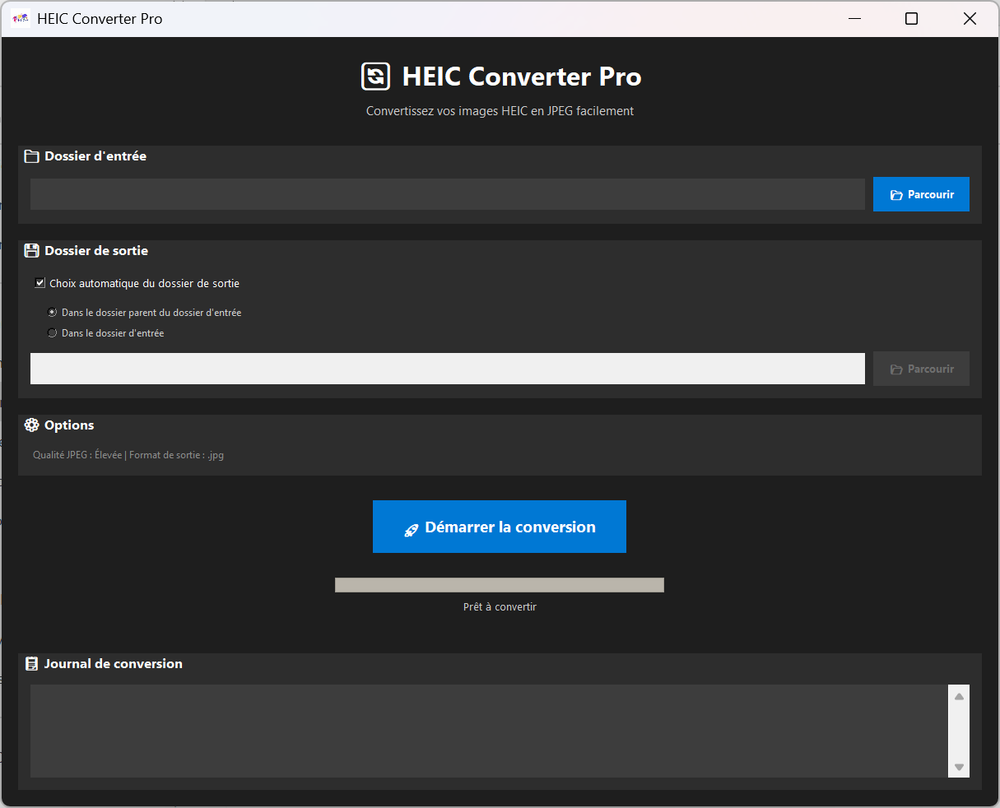

# HEIC Converter

Small python application that allow you to convert a folder (including all subfolders) of HEIC images into JPEG images.


## Authors

- [@Benoît Wattinne](https://www.github.com/Benoit62)

## Installation

Download the .exe file in the Release section.
Windows will trigger security messages while trying to execute the programm. You can bypass them if you trust me, otherwise, see #Self-deployement

## Self deployment

To deploy this project, you need to have Python installed on your PC. You can donwload it [here](https://www.python.org/downloads/ "here")

Donwload the script and then open your command tool.

First, you will need to install all the dependencies.

```bash
  pip install tkinter
```
```bash
  pip install pillow_heif
```
```bash
  pip install pillow
```

Now, you can run the script
```bash
  python path/to/your/script/folder/converter.py
```

## Documentation

Select the input folder where your HEIC images are saved.
You can select the output folder but it is not mandatory.

If no output folder is selected, the application will automaticaly create one in the parent directory of the input folder.

You can start the conversion by clicking the button "Convertir".

First, the program will count the number of files to process.

When done, the conversion while start. You can see the progress of the conversion with the progressbar. You can also see all the files that are processed in the log section

* RED for the current folder processed
* BLUE for the non HEIC images that are only copied to the output folder
* GREEN for the HEIC images that are converted to JPEG images in the output folder

Finaly, when the execution is done, the output folder is opened in your folder explorer to see the result.

## Improvements

- Possibility of choosing individual files instead of entire folder
- Setting to choose to save images individualy in the input folder (next to legacy images)
- Better conversion progress tracking with preview

## Screenshots



